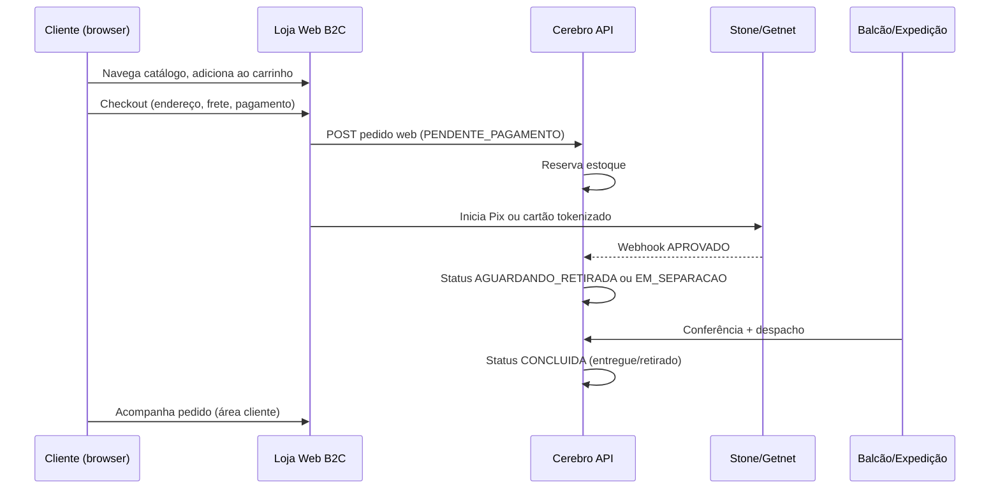

# OmniCore — Módulo E-commerce B2C (planejamento completo)

> **Decisão (Roberto — 01/set/2026):** este é o **último módulo grande** do OmniCore. Só iniciar quando a **loja física** estiver completa e funcional (PDV, Caixa, Salão, estoque, pagamentos reais 14-B/C, operação diária estável).  
> **Assistente:** Logan · **Idioma:** português (BR)

**Relacionado:** `@.cursor/CONTEXTO-OMNICORE.md` (visão omnichannel) · pagamentos **14-B/C** (Stone/Getnet) · fiscal **14-D**

---

## 1. O que este módulo é (e o que não é)

### É

- **Loja web pública** onde o **cliente final** (consumidor) navega, coloca produtos no **carrinho**, informa **entrega**, **paga online** (Pix + cartão) e **acompanha o pedido**.
- Canal **B2C** integrado ao mesmo **Cerebro** (estoque, produtos, vendas, pagamentos).
- Após pagamento aprovado, pedido entra na fila **Balcão / Expedição** da loja para separar e enviar (ou retirada na loja).

### Não é

| Já entregue | Canal | Quem usa |
|-------------|-------|----------|
| PWA **Salão** `/salao` | Loja física | **Vendedor** (colaborador) |
| **PDV** `/pdv` | Loja física | **Operador caixa** |
| **Caixa** `/caixa` | Loja física | **Operador caixa** |
| **Nova Venda** `/vendas/nova` | Backoffice | **Gerente/vendedor** |

O e-commerce **não substitui** esses fluxos — **complementa** o varejo híbrido.

---

## 2. Quando começar (gate de entrada)

Iniciar **Fase 15** somente quando **todos** estiverem ✅:

| # | Pré-requisito | Fase |
|---|---------------|------|
| 1 | PDV, Caixa, Salão, estoque, reserva, cancelamento gerente | Core loja ✅ |
| 2 | Pagamentos loja — simulador validado | 14-A ✅ |
| 3 | **Pix produção** QR tela (Stone/Getnet) — PDV, Caixa, Nova Venda | 14-B |
| 4 | **Maquininha** Stone/Getnet (opcional para web; obrigatório loja) | 14-C |
| 5 | Estorno/conciliação mínima ou plano 14-D acordado | 14-D |
| 6 | Operação real em loja piloto sem bloqueios críticos | Go-live loja |

**Ordem acordada:** `14-B/C/D` (loja + pagamentos reais) → **Fase 15 E-commerce B2C**.

---

## 3. Visão do fluxo (cliente → entrega)



### Modalidades de entrega (MVP v1)

| Modalidade | Descrição | MVP |
|------------|-----------|-----|
| **Entrega** | Correios/transportadora — CEP + frete calculado | ✅ alvo v1 |
| **Retirada na loja** | Cliente busca no balcão | ✅ alvo v1 (mais simples) |
| **Entrega internacional** | Endereço fora do BR | ❌ débito técnico (Sessão 9.1) |

**Decisão vigente:** entregas **somente Brasil**; cliente estrangeiro com endereço BR (já no cadastro `Cliente`).

---

## 4. Ciclo de vida do pedido (status)

### Status já existentes no backend (`StatusVenda`)

```java
PENDENTE              // Salão — aguardando caixa (não usar no web checkout final)
PAGA                  // Liquidada financeiramente
AGUARDANDO_RETIRADA   // E-commerce: pago, fila balcão/expedição  ← alvo pós-pagamento web
CONCLUIDA             // Conferida e entregue/retirada
CANCELADA
```

### Proposta de evolução para Fase 15

| Status | Uso web B2C | Observação |
|--------|-------------|------------|
| `PENDENTE` | Carrinho abandonado / aguardando pagamento | Reutilizar ou criar `AGUARDANDO_PAGAMENTO` (decidir na impl.) |
| `PAGA` | Transição rápida pós-webhook | Pode ir direto para `AGUARDANDO_RETIRADA` no canal web |
| `AGUARDANDO_RETIRADA` | Pedido pago — fila operacional | **Status principal pós-checkout web** |
| `CONCLUIDA` | Entregue ou retirado | Balcão confirma |
| `CANCELADA` | Estorno / cliente desistiu antes do despacho | Regras 11.1 + estorno financeiro 14-D |

**Novo campo recomendado:** `canal_venda` enum — `LOJA_SALAO` | `LOJA_PDV` | `LOJA_CAIXA` | `BACKOFFICE` | **`WEB_B2C`** — para filtros, relatórios e regras de estoque.

**Novo campo recomendado:** `tipo_entrega` — `ENTREGA` | `RETIRADA_LOJA`.

---

## 5. Personas e telas

### 5.1 Cliente final (público + logado)

| Tela | Rota sugerida | Descrição |
|------|---------------|-----------|
| Home / vitrine | `/loja` | Destaques, categorias, busca |
| Listagem categoria | `/loja/categoria/:slug` | Grid de produtos ativos com estoque |
| Detalhe produto | `/loja/produto/:id` | Foto, preço, descrição, estoque, “Adicionar” |
| Carrinho | `/loja/carrinho` | Itens, quantidades, subtotal |
| Checkout | `/loja/checkout` | Endereço, frete, pagamento |
| Pagamento aguardando | `/loja/pedido/:id/aguardando` | Pix QR / status cartão (polling) |
| Confirmação | `/loja/pedido/:id/confirmado` | Resumo + prazo entrega |
| Área do cliente | `/loja/conta` | Pedidos, endereços, dados |
| Login / cadastro | `/loja/entrar`, `/loja/cadastro` | Auth **consumidor** (separado de colaborador) |
| Rastreio | `/loja/pedido/:id` | Status + código rastreio (futuro) |

**Layout:** separado do `Layout.tsx` operacional (sem menu PDV/Caixa). PWA opcional (Fase 15.2).

### 5.2 Operador balcão / expedição (colaborador — extensão do backoffice)

| Tela | Rota sugerida | Descrição |
|------|---------------|-----------|
| Fila e-commerce | `/balcao/pedidos` | Lista `AGUARDANDO_RETIRADA` canal WEB |
| Detalhe separação | `/balcao/pedidos/:id` | Itens, endereço, imprimir picking list |
| Conferir e despachar | ação | Marca `CONCLUIDA` + código rastreio |
| Retirada na loja | ação | Confirma identidade + `CONCLUIDA` |

**Perfil:** VENDEDOR, CONFERENTE ou perfil novo `EXPEDICAO` (decidir na impl.).

### 5.3 Gerente

- Mesmas telas + cancelamento com autorização (regra 11.1).
- Dashboard: pedidos web vs loja, ticket médio, abandono carrinho (futuro).

---

## 6. Pagamentos no e-commerce

Reutilizar **mesmo motor** (`PagamentoService` + adapters Stone/Getnet) — **sem maquininha** no web.

| Forma | Web B2C | Implementação |
|-------|---------|---------------|
| **Pix** | ✅ principal | QR/copia-e-cola na tela checkout; webhook PSP |
| **Cartão crédito** | ✅ | Gateway tokenizado (PCI no PSP); parcelas |
| **Cartão débito** | ⚠️ | Via 3DS online se PSP suportar |
| **Dinheiro** | ❌ | Só loja física |

**UX:** igual PDV pós-14-A — tela “Aguardando Pix” com polling; nunca mock na UI.

**Provider enum:** `STONE`, `GETNET`, etc. em `tb_pagamento_venda.provider`.

---

## 7. Estoque e reserva

| Momento | Comportamento proposto |
|---------|------------------------|
| Adicionar ao carrinho (sessão) | Opcional: reserva soft TTL (ex. 15 min) — débito técnico |
| Checkout iniciado | **Reserva estoque** (mesma regra 13+ loja) |
| Pagamento aprovado | Baixa definitiva ou confirma reserva |
| Pagamento recusado / timeout | Libera reserva |
| Cancelamento pós-pago | Estorno estoque + financeiro (14-D) |

Reutilizar serviços de estoque existentes; parametrizar por `canal_venda` se regras divergirem.

---

## 8. Frete e endereço

### MVP v1

- **CEP** → ViaCEP (já usado no cadastro cliente) + tabela frete simplificada:
  - Faixa CEP / região / peso fixo por produto (`indicadorTamanho` PEQUENO/MEDIO/GRANDE).
  - Ou frete fixo por pedido (config loja).
- **Retirada na loja:** frete R$ 0; endereço da loja exibido após confirmação.

### Evolução (v2+)

- Integração Correios/Melhor Envio API.
- Múltiplos endereços por cliente (`tb_endereco_cliente`).
- Prazo de entrega dinâmico.

### Dados por pedido

Snapshot do endereço na venda (não mudar se cliente editar cadastro depois):

- `endereco_entrega_*` em `tb_venda` ou tabela `tb_venda_entrega`.

---

## 9. Autenticação e segurança

### Dois mundos de auth

| Tipo | Hoje | Fase 15 |
|------|------|---------|
| **Colaborador** | JWT `/api/auth/login` | Mantém |
| **Consumidor** | ❌ | Novo: registro, login, refresh token ou sessão |

**Opções (decidir na impl.):**

1. **Conta consumidor** = registro em `tb_cliente` + senha hash (campo novo) + JWT scope `CLIENTE`.
2. **Checkout convidado** — email + CPF + endereço sem senha; link mágico para rastreio.
3. **Híbrido** — convidado no MVP; conta opcional.

### APIs públicas vs protegidas

| Endpoint | Auth |
|----------|------|
| `GET /api/loja/produtos` (catálogo) | Público (rate limit) |
| `GET /api/loja/produtos/:id` | Público |
| `POST /api/loja/carrinho/checkout` | Sessão cliente ou convidado |
| `GET /api/loja/meus-pedidos` | JWT consumidor |
| `/api/balcao/pedidos` | JWT colaborador |

### Segurança

- Rate limiting catálogo/checkout.
- Cartão **nunca** persiste PAN — só token PSP.
- HTTPS obrigatório produção.
- LGPD: consentimento, política privacidade, exclusão conta (futuro).

---

## 10. Backend — APIs novas (esboço)

### Catálogo público

```
GET  /api/loja/produtos?page&categoria&busca
GET  /api/loja/produtos/{id}
GET  /api/loja/categorias
```

Filtros: `ativo=true`, `saldo > 0` (ou exibir “indisponível”).

### Carrinho / pedido

```
POST /api/loja/pedidos              # cria PENDENTE + itens + endereço + frete
POST /api/loja/pedidos/{id}/pagar   # inicia Pix/cartão (PaymentExperiencePort)
GET  /api/loja/pedidos/{id}         # status (polling cliente)
```

Webhook existente: `POST /api/pagamentos/webhook` — ao aprovar, transiciona para `AGUARDANDO_RETIRADA`.

### Balcão

```
GET  /api/balcao/pedidos?status=AGUARDANDO_RETIRADA&canal=WEB_B2C
PUT  /api/balcao/pedidos/{id}/despachar   # rastreio + status
PUT  /api/balcao/pedidos/{id}/concluir    # retirada ou entregue
```

### Auth consumidor

```
POST /api/loja/auth/registrar
POST /api/loja/auth/login
POST /api/loja/auth/recuperar-senha   # v2
```

---

## 11. Frontend — estrutura sugerida

```
frontend-app/src/
├── loja/                    # módulo B2C (novo)
│   ├── layout/LojaLayout.tsx
│   ├── pages/
│   │   ├── LojaHomePage.tsx
│   │   ├── LojaProdutoPage.tsx
│   │   ├── LojaCarrinhoPage.tsx
│   │   ├── LojaCheckoutPage.tsx
│   │   ├── LojaPedidoPage.tsx
│   │   └── LojaContaPage.tsx
│   ├── components/
│   │   ├── ProductCard.tsx
│   │   ├── CartDrawer.tsx
│   │   └── CheckoutSteps.tsx
│   ├── hooks/useLojaCart.ts
│   └── api/loja.ts
├── balcao/                  # operação expedição (novo)
│   └── pages/BalcaoPedidosPage.tsx
```

**Rotas em `App.tsx`:** prefixo `/loja/*` **fora** de `ProtectedRoute` colaborador (exceto rotas conta logada).

---

## 12. Modelo de dados — extensões propostas

| Tabela / campo | Propósito |
|----------------|-----------|
| `tb_venda.canal_venda` | Origem WEB_B2C vs PDV etc. |
| `tb_venda.tipo_entrega` | ENTREGA \| RETIRADA_LOJA |
| `tb_venda.frete_valor` | Valor frete |
| `tb_venda.endereco_entrega_*` | Snapshot entrega |
| `tb_venda.codigo_rastreio` | Correios/transportadora |
| `tb_cliente.senha_hash` | Login consumidor (se conta) |
| `tb_cliente.email_verificado` | Confirmação email |
| `tb_carrinho` (opcional) | Persistência server-side v2 |

---

## 13. Subfases de implementação (Fase 15)

| Subfase | Escopo | Entregável |
|---------|--------|------------|
| **15-A** | Catálogo público + carrinho local (sem pagamento) | `/loja` navegável |
| **15-B** | Checkout + endereço + frete fixo + retirada | Pedido PENDENTE |
| **15-C** | Pagamento web Stone/Getnet (Pix + cartão) | Pedido pago → `AGUARDANDO_RETIRADA` |
| **15-D** | Balcão/expedição colaborador | Separar, despachar, `CONCLUIDA` |
| **15-E** | Conta cliente + histórico pedidos | `/loja/conta` |
| **15-F** | Frete API Correios/Melhor Envio | Prazo real |
| **15-G** | PWA loja + SEO + performance | Lighthouse, sitemap |

**MVP mínimo go-live web:** **15-A + 15-B + 15-C + 15-D** (retirada na loja pode anteceder entrega por CEP).

---

## 14. O que reutilizar do OmniCore atual

| Módulo existente | Reuso no e-commerce |
|------------------|---------------------|
| `Produto`, estoque, saldo | Catálogo — API filtrada |
| `ComposicaoPacote` (kits) | Exibir kit como produto |
| `Cliente` + endereço BR | Checkout + cadastro |
| `Venda` + itens | Pedido web = mesma entidade |
| `PagamentoService` + webhook | Pix/cartão web |
| `PagamentoPanel` / polling UX | Padrão “aguardando pagamento” |
| MinIO `urlImagem` | Fotos catálogo |
| Cancelamento 11.1 | Pedidos web cancelados por gerente |
| Reserva estoque 13+ | Checkout web |

---

## 15. Débitos técnicos (fora MVP v1)

- Entrega internacional (Sessão 9.1 Fase B).
- Múltiplas formas de pagamento no mesmo pedido (split).
- Cupom desconto / cashback.
- Wishlist, avaliações, recomendação.
- Abandono de carrinho (email marketing).
- Antifraude avançado (ClearSale etc.).
- NF-e consumidor (14-D integrado).
- Marketplace multi-loja (OmniCore multi-tenant).

---

## 16. Critérios de aceite (MVP Fase 15)

1. Cliente anônimo ou logado compra **2+ produtos** no `/loja`.
2. Escolhe **entrega** ou **retirada**; vê frete ou R$ 0.
3. Paga com **Pix** ou **cartão** (Stone/Getnet sandbox).
4. Pedido aparece em **`/balcao/pedidos`** como `AGUARDANDO_RETIRADA`.
5. Operador confere e marca **`CONCLUIDA`**; estoque correto.
6. Cliente vê status em **`/loja/pedido/:id`**.
7. Pedido web aparece na listagem **`/vendas`** com filtro canal WEB (auto-refresh).

---

## 17. Testes

| Camada | Escopo |
|--------|--------|
| Backend | Checkout, reserva, webhook → status, balcão |
| Frontend Vitest | Carrinho, frete, checkout validation |
| E2E manual | Fluxo completo + PSP sandbox |
| Carga | Catálogo público rate limit (futuro) |

---

## 18. Referências no repositório

| Arquivo | Conteúdo |
|---------|----------|
| `StatusVenda.java` | `AGUARDANDO_RETIRADA` já previsto para e-commerce |
| `Cliente.java` | Endereço entrega BR |
| `CONTEXTO-OMNICORE.md` | Visão omnichannel, 14-B/C/E |
| `PaymentExperiencePort` | Adapters pagamento |
| `README.md` | Tabela canal Web + Balcão |

---

## 19. Mensagem para restaurar sessão (Fase 15)

```
@.cursor/CONTEXTO-OMNICORE.md
@.cursor/ECOMMERCE-B2C-PLANEJAMENTO.md

Olá Logan, vamos iniciar a Fase 15 — E-commerce B2C (subfase 15-A: catálogo público).
Pré-requisitos 14-B/C devem estar OK.
```

---

*Documento criado: 01/set/2026 — Roberto + Logan. Último módulo após loja física + pagamentos reais completos.*
